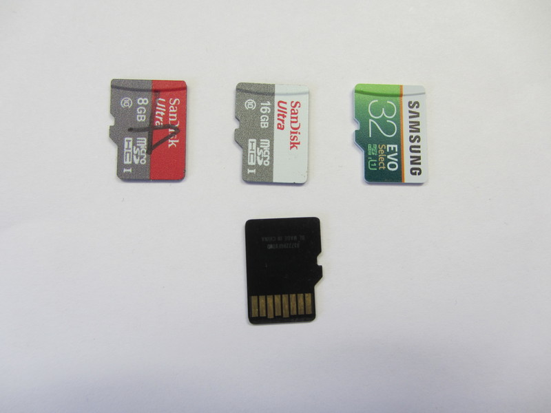

#HSLIDE

## HAM Radio Digital Appliance
###### Basil Gunn  N7NIX,  last edit Feb. 28, 2019

###### https://gitpitch.com/nwdigitalradio/draws-appliance
###### https://github.com/nwdigitalradio/draws-appliance

#HSLIDE
### Appliance components
* Raspberry Pi 3 Model B+ ($38)
  * current latest
* Draws - Rasberry Pi HAT ($150)
* Display ($111)
* Keyboard & mouse ($60)
* Radio, preferably with a mini din6 data port
* Storage device 8, 16 or 32GB micro SD card ($5.75)
* Power: 12V battery/power supply

#HSLIDE
### Raspberry Pi
* Small single board computer developed in UK
* Originally released Feb. 29, 2012
  * Several generations have been released
  * Raspberry Pi 1 Model B
  * Raspberry Pi 3 Model B+
* 19M sold by March 2018
* Manufactured in Wales, China & Japan
* Features a Broadcom system on a chip (SoC)
  * ARM compatible CPU

#HSLIDE
### Raspberry Pi

#HSLIDE
### Raspberry Pi - from the bottom

#HSLIDE
### Displays

* 7" Raspberry Pi Touchscreen
  * 800 x 480
* 7" Sunfounder
  *  1024 x600
* 10" Sunfounder
  * 1280 x 800
* My workstation 5120x1440

#HSLIDE
### 7" Displays
* Raspberry Pi 7" Touchscreen LCD Display
* SmartPi Touch Case for Raspberry Pi

#HSLIDE
### 7" Displays From the back

#HSLIDE
### 7" Displays Again

#HSLIDE
## 10" Display front

* Hactar - A giant spaceborne supercomputer built by the Silastic Armorfiends of Striterax.

#HSLIDE
### 10" Display back

#HSLIDE
### DRAWS Raspberry Pi HAT
* High performance sound chip (CODEC)
* GPS with pulse per second
* 12V buck regulator
* 2 mini Din6 connectors
* 8 pin accessory port
  * 2 A/D ports
  * Serial port
  * 2 GPIO

#HSLIDE
### Draws board with GPS antenna attached

#HSLIDE
### Keyboard & mouse
* Logitech Living-Room Keyboard k830 ($60)
* Logitech Wireless mouse ($17)
* Logitech Keys-to-Go ($45)

#HSLIDE
### micro SD Card
* mSD card images available with many HAM apps pre-installed.

#HSLIDE
### What Can I do with it?

##### Packet
##### Other digital modes

#HSLIDE

### Packet
* Winlink email via radio
* Keyboard to keyboard chat
* Connected mode to BBS
* APRS - Automatic Packet Reporting System
  * Xastir
  * YAAC - Yet Another APRS Client

#HSLIDE

### Other Digital modes (mostly HF)
* js8call
* wsjt-x
* fldigi

#HSLIDE

### Questions/Discussion
