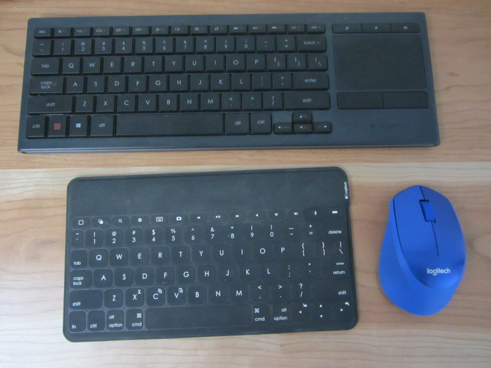
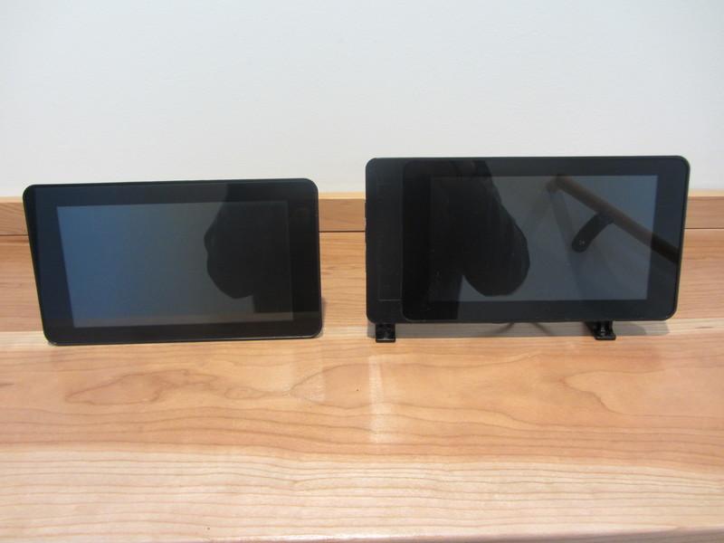
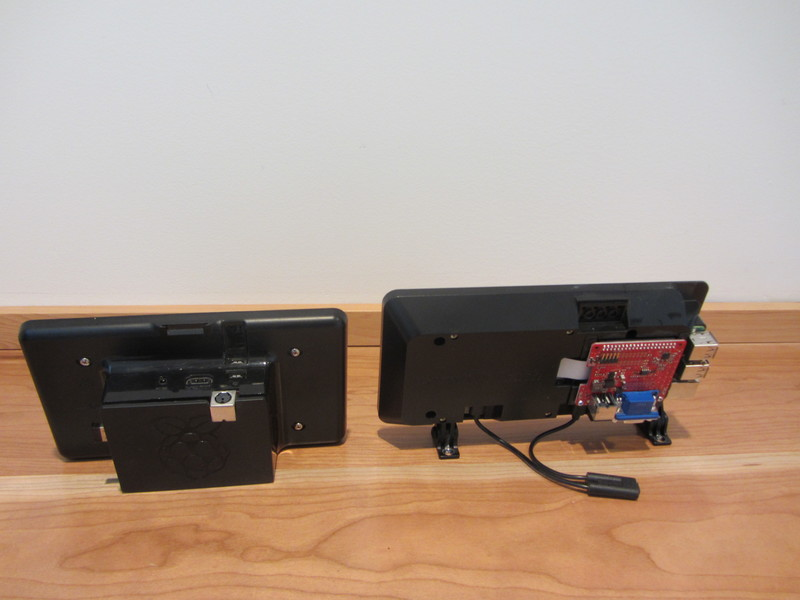
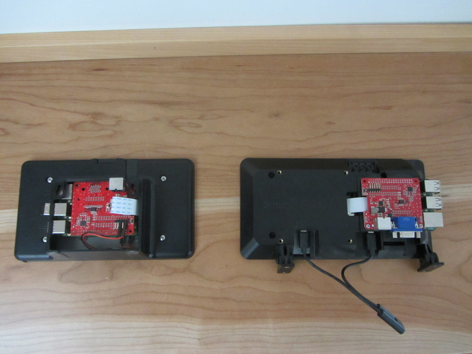
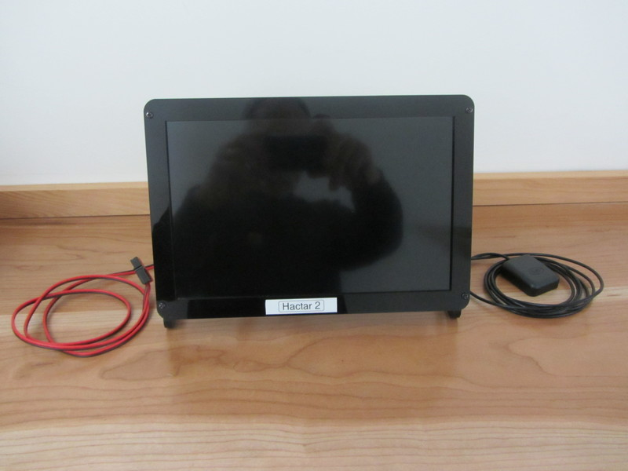
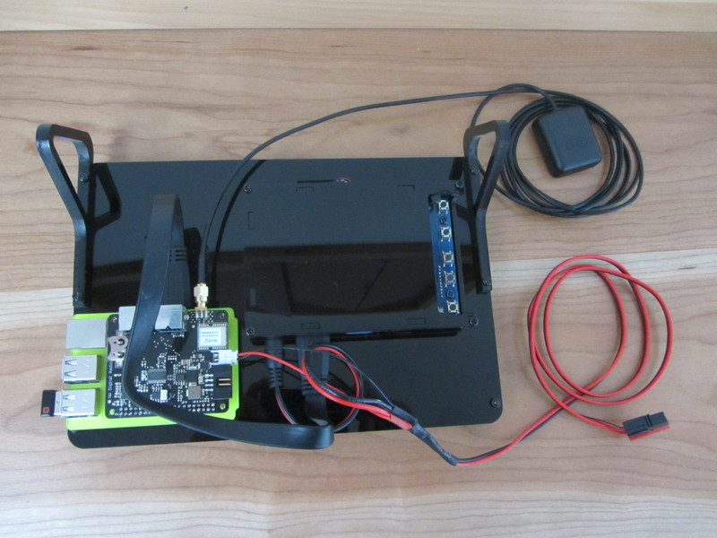
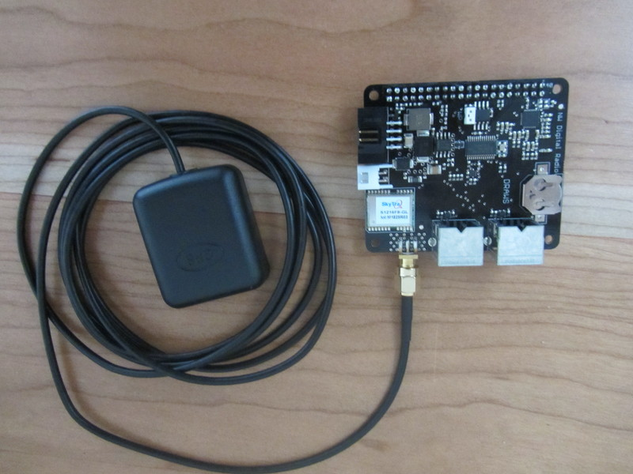
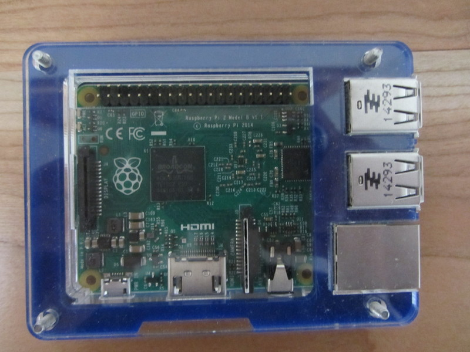
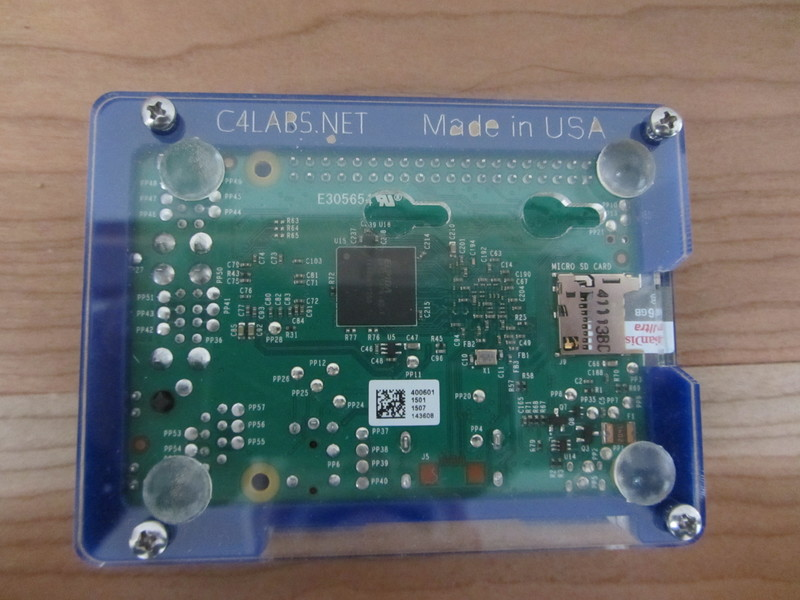

#HSLIDE

## HAM Radio Digital Appliance
###### Basil Gunn  N7NIX,  last edit Feb. 28, 2019

###### https://gitpitch.com/nwdigitalradio/draws-appliance
###### https://github.com/nwdigitalradio/draws-appliance

#HSLIDE
### Appliance components
* Raspberry Pi 3 Model B+
  * current latest
* Draws - Rasberry Pi HAT
  * High performance sound chip (CODEC)
  * GPS with pulse per second
  * 12V buck regulator
* Display
* Keyboard & mouse

#HSLIDE
### Keyboard & mouse

#HSLIDE
### Displays

* 7" Raspberry Pi Touchscreen
  * 800 x 480
* 7"Sunfounder
  *  1024 x600
* 10" Sunfounder
  * 1280 x 800
* My workstation 5120x1440

#HSLIDE
### 7" Displays
* Raspberry Pi 7" Touchscreen LCD Dispaly
* SmartPi Touch Case for Raspberry Pi

#HSLIDE
### 7" Displays From the back

#HSLIDE
### 7" Displays Again

#HSLIDE
## 10" Display front

#HSLIDE
### 10" Display back

#HSLIDE
### Draws board with GPS antenna attached

#HSLIDE
### Raspberry Pi

#HSLIDE
### Raspberry Pi - from the bottom

#HSLIDE
### What Can I do with it?

##### Packet
##### Digital Voice - DStar
##### Other digital modes

#HSLIDE

### Packet
* Winlink
* Keyboard to keyboard
* Connected mode to BBS
* APRS - Automatic Packet Reporting System
  * Xastir
  * YAAC - Yet Another APRS Client

#HSLIDE

#### Digital Voice - DStar

#HSLIDE

### Other Digital modes (mostly HF)
* js8call
* wsjt-x
* fldigi
